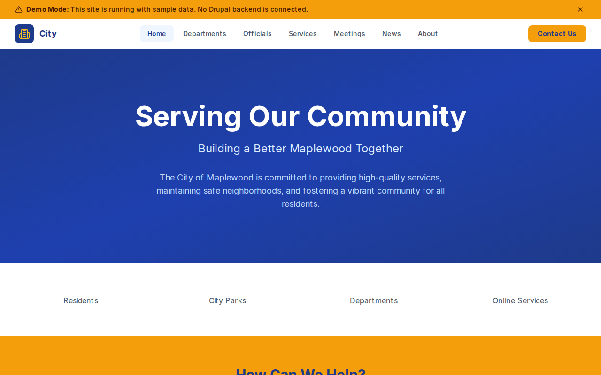

# Decoupled City

A city government website starter template for Decoupled Drupal + Next.js. Built for municipalities, city halls, and local government agencies.



## Features

- **City Departments** - Public Works, Parks & Recreation, Public Safety, and more with contact info and hours
- **Government Officials** - Mayor, council members, and department heads with bios and contact details
- **City Services** - Permits, utilities, facility rentals, and business licenses with eligibility and fees
- **Public Meetings** - City council sessions, planning commission hearings, and town halls with agendas
- **News & Announcements** - Press releases, infrastructure updates, and community event coverage
- **Modern Design** - Clean, accessible UI optimized for municipal government content

## Quick Start

### 1. Clone the template

```bash
npx degit nextagencyio/decoupled-city my-city
cd my-city
npm install
```

### 2. Run interactive setup

```bash
npm run setup
```

This interactive script will:
- Authenticate with Decoupled.io (opens browser)
- Create a new Drupal space
- Wait for provisioning (~90 seconds)
- Configure your `.env.local` file
- Import sample content

### 3. Start development

```bash
npm run dev
```

Visit [http://localhost:3000](http://localhost:3000)

---

## Manual Setup

<details>
<summary>Click to expand manual setup steps</summary>

### Authenticate with Decoupled.io

```bash
npx decoupled-cli@latest auth login
```

### Create a Drupal space

```bash
npx decoupled-cli@latest spaces create "My City"
```

Note the space ID returned. Wait ~90 seconds for provisioning.

### Configure environment

```bash
npx decoupled-cli@latest spaces env 1234 --write .env.local
```

### Import content

```bash
npm run setup-content
```

This imports:
- Homepage with statistics and call to action
- 4 City Departments (Public Works, Parks & Rec, Public Safety, Community Development)
- 4 Government Officials (Mayor, City Manager, Council Member, Fire Chief)
- 4 City Services (Building Permits, Water & Sewer, Facility Rentals, Business License)
- 3 Public Meetings (City Council, Planning Commission, Town Hall)
- 3 News Articles
- 2 Static Pages (About, Contact)

</details>

## Content Types

### Department
- **Phone / Email** - Department contact information
- **Location** - Physical office address
- **Office Hours** - When the department is open
- **Category** - Taxonomy grouping (Public Works, Parks & Recreation, etc.)
- **Image** - Department photo

### Government Official
- **Position/Title** - Role in city government
- **Department** - Associated department
- **Email / Phone** - Contact information
- **Office Location** - Where to find the official
- **Photo** - Official headshot

### City Service
- **Department** - Responsible department
- **Online Service URL** - Link to apply or access service online
- **Eligibility** - Who qualifies for the service
- **Fee** - Cost of the service
- **Image** - Service illustration

### Public Meeting
- **Meeting Date / End Date** - Meeting timing
- **Location** - Where the meeting is held
- **Meeting Type** - Category (City Council, Planning Commission, Town Hall, etc.)
- **Agenda URL** - Link to meeting agenda
- **Image** - Meeting photo

### News Article
- **Featured Image** - Article image
- **Category** - News category (Announcements, Infrastructure, Public Safety, etc.)
- **Featured** - Whether to highlight the article

## Customization

### Colors & Branding
Edit `tailwind.config.js` to customize colors, fonts, and spacing.

### Content Structure
Modify `data/city-content.json` to add or change content types and sample content.

### Components
React components are in `app/components/`. Update them to match your design needs.

## Demo Mode

Demo mode allows you to showcase the application without connecting to a Drupal backend.

### Enable Demo Mode

```bash
NEXT_PUBLIC_DEMO_MODE=true
```

### Removing Demo Mode

1. Delete `lib/demo-mode.ts`
2. Delete `data/mock/` directory
3. Delete `app/components/DemoModeBanner.tsx`
4. Remove `DemoModeBanner` from `app/layout.tsx`
5. Remove demo mode checks from `app/api/graphql/route.ts`

## Deployment

### Vercel (Recommended)
[](https://vercel.com/new/clone?repository-url=https://github.com/nextagencyio/decoupled-city)

### Other Platforms
Works with any Node.js hosting platform that supports Next.js.

## Documentation

- [Decoupled.io Docs](https://www.decoupled.io/docs)
- [Next.js Documentation](https://nextjs.org/docs)
- [Drupal GraphQL](https://www.decoupled.io/docs/graphql)

## License

MIT
